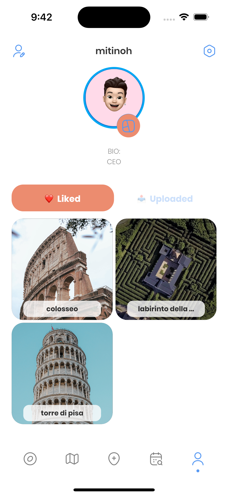

# xplore

## A Flutter application made to practice the principles of bloc architecture and firebase auth.

This application aims to give a new experience to all those people who love travel and explore new places.

### Introduction.

- Below we see an elegant login screen with both light and dark themes, alongside the home screen which will present places that may be of interest to the user with a "TikTok" effect.

  
  

- Here instead we can see on the left a page with the map in the background on which the various points of interest will be displayed and clicking on one of them will display a detail as shown in the image. On the other hand, however, there is the screen dedicated to the user with the places visited, liked and much more.

  
  

- Last but not least the: "Planner", this feature allows through a series of questions to build the perfect holiday for you according to your tastes and preferences, what are you waiting for?

  
  

## Get start

Note:

- You already need flutter installed on your device
- This application uses a custom backend, if not avaiable download from this [repo](https://github.com/mitinoh/xplore-nj.git), run and change in `lib/data/api/rest_client.dart` the `baseUrl`.
- This application also use Firebase auth for user authentication, if not avaiable just remove comment on `lib/app/app.dart` `r.155`.

Before run project, execute this commands:
- `flutter clean`
- `flutter pub get`
- `flutter pub run build_runner build` or `flutter pub run build_runner build --delete-conflicting-outputs`
- `flutter run` (if needed)

## Plugins
Plugin | Usage
------------ | -------------
[retrofit](https://pub.dev/packages/retrofit#-readme-tab-) | For working with restful API, generated model
[json_annotation](https://pub.dev/packages/json_annotation#-readme-tab-) | Same as above (SAA)
[dio](https://pub.dev/packages/dio) | SAA
[build_runner](http://build_runner) | SAA
[flutter_bloc](https://pub.dev/packages/flutter_bloc) | For build app architecture
[freezed](https://pub.dev/packages/freezed) | Working with State of bloc
[equatable](https://pub.dev/packages/equatable) | SAA
[shared_preferences](https://pub.dev/packages/shared_preferences) | For caching user’s session
[firebase_core](https://pub.dev/packages/firebase_core) | For register account and login using Firebase
[google_sign_in](https://pub.dev/packages/google_sign_in) | SAA
[firebase_auth](https://pub.dev/packages/firebase_auth) | SAA

## Support
 If you like my work and want to support give a ⭐ to the repo.

 

Thank you so much ❤️.
